# Архитектура сервера

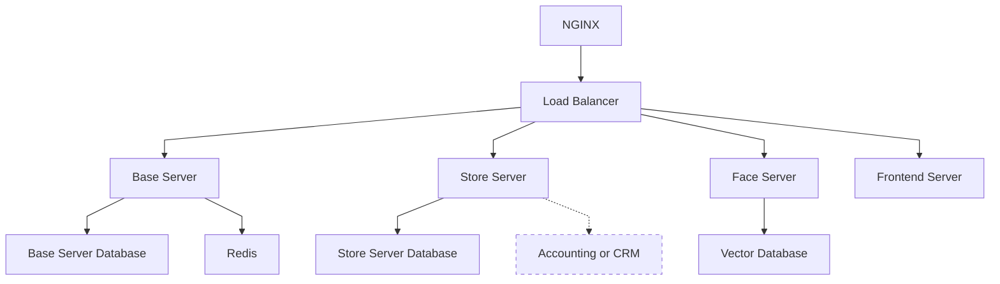

Главной технической частью проекта является сервер.
Он состоит из нескольких модулей которые представлены в диаграмме выше.

## Высокоуровневая архитектура

Backend состоит из 4 основных модулей:

- Основной сервис
- Сервис магазинов
- Сервис биометрии
- Frontend

Так же есть несколько дополнительных модулей:

- DebugConsole (для отладки, временно заменяет админ панель)
- DebugData (набор тестовых данных)

Входным шлюзом служит Nginx и его встроенный балансировщик нагрузок.

Каждому модулю так же соответствует база данных (за исключением frontend).

## Запуск сервера

Сервер запускается посредством Docker Compose. В корне проекта находится файл конфигурации `compose.yml`.

```bash
docker-compose up -d --build
```

## Nginx

Конфигурации nginx находятся в корне проекта (файл `nginx.conf`).
Она автоматически монтируется в образ Docker.

Монтируются следующие пути:

- `/static` - статический контент
- `/keycloak` - доступ к keycloak
- `/base_api` - основной сервис
- `/store_api` - сервис магазинов

# Общее описание модулей

Все модули имеют определенный шаблон:

```dirs-tree
/module_name
├── app
├──── main.py
├──── config.py
├── pyproject.toml
├── poetry.toml
└── Dockerfile
```

- `app` (или `src`) - содержит исходный код модуля
- `pyproject.toml` - Зависимости
- `poetry.toml` - конфигурация poetry
- `Dockerfile` - конфигурация docker (при необходимости)
- `config.py` - конфигурация приложение (
  используется [pydantic-settings](https://pydantic-docs.helpmanual.io/usage/settings/))

Все модули (работающие на python) используют [poetry](https://python-poetry.org) для управления зависимостями.

Стандартная конфигурация poetry (`poetry.toml`)

```toml
[virtualenvs]
in-project = true # Создавать виртуальное окружение внутри проекта
```

## Серверные модули

Как осноной способ взаимодействия используется REST API

- Основной фреймворк - [FastAPI](https://fastapi.tiangolo.com)
- Реляциональная база данных - [Postgres](https://www.postgresql.org/)
- Кэш - [Redis](https://redis.io/)
- Векторная база данных - [ChromaDB](https://github.com/duckdblabs/chroma)
- Миграция базы данных - [alembic](https://alembic.sqlalchemy.org/en/latest/)

Базовая структура:

```dirs-tree
app
├── alembic
├── models
├── some_submodule
├──── schemes
├──── router
├──── service
├──── depencies
├── main.py
├── alembic.ini
├── dependencies
└── schemes
```

- `main.py` содержит root router. Все другие модули подключаются к нему из `some_submodule/router.py`.
- `service.py` содержит бизнес логику.
- `router` роутеры отдельных submodules.
- `depencies`, `schenes`, `exceptions`, ... - зависимости, схемы, исключения... Могу быть глобальные и привязанные к
  отельным
  submodules
- `alembic.ini` - конфигурация alembic
- `models` - модели базы данных
- `alembic` - система миграции баз данных. Стандартный `env.py` был переписан

# Base Server

Основной сервер. Отвечает почти за все взаимодействие с роботом, на время тестов эмулирует логику основного сервера ЖД
компании

## Submodules

- `admin` - отвечает за отладку, заменяет основной сервис ЖД компании. Отвечает за создание билетов, регистрацию
  инженеров
  и так далее. Исключительно на время разработки, использование на проде не предусмотренно
- `auth` - отвечает за авторизацию. Предоставляет Dependencies для авторизации пользователя
- `robot` - отвечает за работу компонентов системы.
  Реализует такие функции как проверка билетов, авторизация пользователей и т. д.
- `users` - отвечает за работу с пользователями. В основном предоставление информации для робота
- `face_api` - внешняя зависимость сервиса биометрии
- `store_api` - внешняя зависимость сервиса магазинов
- `redis_async` - небольшая обертка для работы с redis через асинхронный контекстный менеджер

## База данных

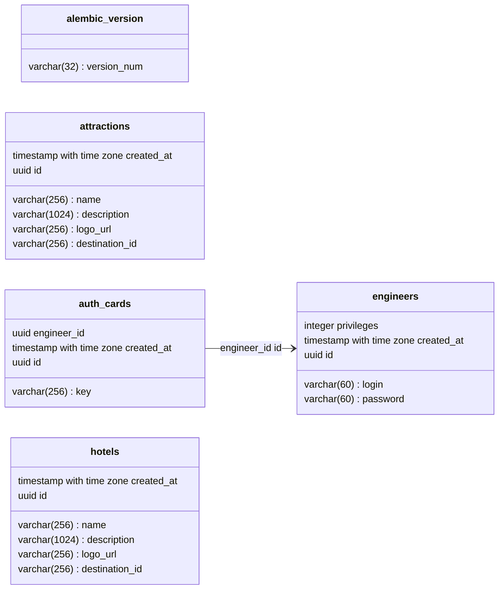

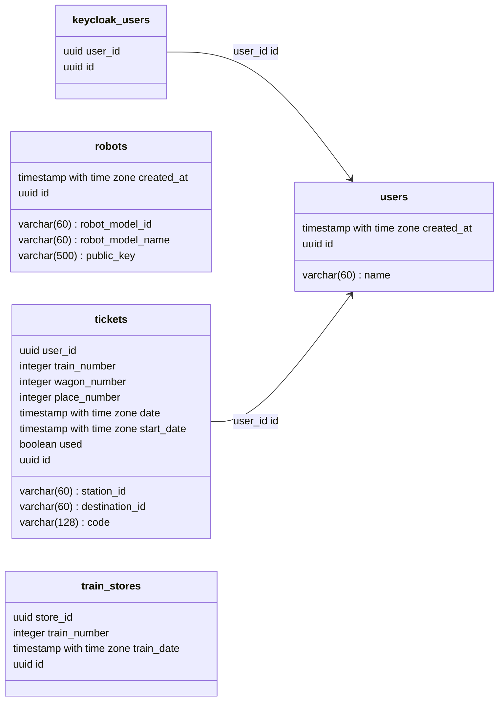

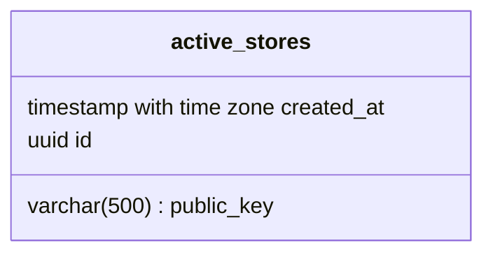

## Эндпоинты

### 1. Управление пользователями

#### Добавить пользователя

**Эндпоинт:** `POST /admin/user`

**Описание:** Добавляет нового пользователя.

**Тело запроса:**

```json
{
  "name": "string",
  "face": "string (необязательно)"
}
```

**Ответ:**

```json
{
  "id": "string",
  "name": "string"
}
```

**Ошибки:**

- `422 Ошибка валидации`

#### Обновить лицо пользователя

**Эндпоинт:** `PATCH /admin/user/{user_id}/face`

**Описание:** Обновляет данные лица пользователя.

**Параметры:**

- `user_id` (строка, обязательно): ID пользователя.

**Тело запроса:**

```json
{
  "face": "string"
}
```

**Ответ:**

```json
{
  "status": "OK"
}
```

**Ошибки:**

- `422 Ошибка валидации`

#### Удалить лицо пользователя

**Эндпоинт:** `DELETE /admin/user/face`

**Описание:** Удаляет данные лица пользователя.

**Параметры:**

- `user_id` (query, обязательно, строка): ID пользователя.

**Ответ:**

```json
{
  "status": "OK"
}
```

**Ошибки:**

- `422 Ошибка валидации`

#### Получить пользователей

**Эндпоинт:** `GET /admin/users`

**Описание:** Получает список пользователей с пагинацией.

**Параметры:**

- `page` (query, необязательно, целое число, по умолчанию: 1): Номер страницы.
- `size` (query, необязательно, целое число, по умолчанию: 50, макс: 100): Размер страницы.

**Ответ:**

```json
{
  "items": [
    {
      "id": "string",
      "name": "string"
    }
  ],
  "total": 100,
  "page": 1,
  "size": 50
}
```

**Ошибки:**

- `422 Ошибка валидации`

#### Удалить пользователя

**Эндпоинт:** `DELETE /admin/users/{user_id}`

**Описание:** Удаляет конкретного пользователя.

**Параметры:**

- `user_id` (path, обязательно, строка): ID пользователя.

**Ответ:**

```json
{
  "status": "OK"
}
```

**Ошибки:**

- `422 Ошибка валидации`

### 2. Управление инженерами

#### Создать инженера

**Эндпоинт:** `POST /admin/engineer`

**Описание:** Создает нового инженера.

**Тело запроса:**

```json
{
  "login": "string",
  "password": "string"
}
```

**Ответ:**

```json
{
  "id": "string",
  "login": "string"
}
```

**Ошибки:**

- `422 Ошибка валидации`

#### Удалить инженера

**Эндпоинт:** `DELETE /admin/engineers/{engineer_id}`

**Описание:** Удаляет инженера.

**Параметры:**

- `engineer_id` (path, обязательно, строка): ID инженера.

**Ответ:**

```json
{
  "status": "OK"
}
```

**Ошибки:**

- `422 Ошибка валидации`

#### Получить инженеров

**Эндпоинт:** `GET /admin/engineers`

**Описание:** Получает список инженеров с пагинацией.

**Параметры:**

- `page` (query, необязательно, целое число, по умолчанию: 1): Номер страницы.
- `size` (query, необязательно, целое число, по умолчанию: 50, макс: 100): Размер страницы.

**Ответ:**

```json
{
  "items": [
    {
      "id": "string",
      "login": "string"
    }
  ],
  "total": 100,
  "page": 1,
  "size": 50
}
```

**Ошибки:**

- `422 Ошибка валидации`

#### Обновить привилегии инженера

**Эндпоинт:** `PUT /admin/engineer_privileges`

**Описание:** Обновляет привилегии инженера.

**Тело запроса:**

```json
{
  "id": "string",
  "privileges": [
    "ROBOT_LOGIN",
    "STORE_LOGIN"
  ]
}
```

**Ответ:**

```json
{
  "status": "OK"
}
```

**Ошибки:**

- `422 Ошибка валидации`

### 3. Управление магазинами

#### Добавить магазин в обучение

**Эндпоинт:** `POST /admin/store/{store_id}/train`

**Описание:** Добавляет магазин в обучающие данные.

**Параметры:**

- `store_id` (path, обязательно, строка): ID магазина.

**Тело запроса:**

```json
{
  "train_number": 123,
  "train_date": "2025-02-01T00:00:00Z"
}
```

**Ответ:**

```json
{
  "status": "OK"
}
```

**Ошибки:**

- `422 Ошибка валидации`

#### Удалить магазин из обучения

**Эндпоинт:** `DELETE /admin/store/{store_id}/train/unbind`

**Описание:** Удаляет магазин из обучающих данных.

**Параметры:**

- `store_id` (path, обязательно, строка): ID магазина.

**Тело запроса:**

```json
{
  "train_number": 123,
  "train_date": "2025-02-01T00:00:00Z"
}
```

**Ответ:**

```json
{
  "status": "OK"
}
```

**Ошибки:**

- `422 Ошибка валидации`

### 4. Управление билетами

#### Создать билет

**Эндпоинт:** `POST /admin/ticket`

**Описание:** Создает новый билет.

**Тело запроса:**

```json
{
  "user_id": "string",
  "train_number": 123,
  "wagon_number": 5,
  "place_number": 12,
  "station_id": "string",
  "destination": "string",
  "date": "2025-02-01T00:00:00Z",
  "start_date": "2025-02-01T00:00:00Z"
}
```

**Ответ:**

```json
{
  "id": "string",
  "train_number": 123,
  "wagon_number": 5,
  "place_number": 12,
  "destination": "string"
}
```

**Ошибки:**

- `422 Ошибка валидации`

# Store Server

Отвечает за работу магазинов

## Submodules

- `admin` - отвечает за отладку, заменяет основной сервис ЖД компании. Отвечает за создание билетов, регистрацию
  инженеров
  и так далее. Исключительно на время разработки, использование на проде не предусмотренно
- `redis_async` - небольшая обертка для работы с redis через асинхронный контекстный менеджер
- `robot` - взаимодействие с роботом
- `store` - взаимодействие с магазинами

## База данных


## Эндпоинты

### 1. Управление магазинами

#### Создание магазина

**Конечная точка:** `POST /admin/store`

**Описание:** Создает новый магазин.

**Тело запроса:**

```json
{
  "name": "string",
  "description": "string",
  "logo_url": "string",
  "store_type": "SHOP | RESTAURANT"
}
```

**Ответ:**

```json
{
  "id": "string",
  "name": "string",
  "description": "string",
  "logo_url": "string",
  "store_type": "SHOP | RESTAURANT"
}
```

**Ошибки:**

- `422 Ошибка валидации`

#### Получение списка магазинов

**Конечная точка:** `GET /admin/stores`

**Описание:** Получает список магазинов.

**Параметры запроса:**

- `page` (integer, по умолчанию: 1) - Номер страницы
- `size` (integer, по умолчанию: 50, макс: 100) - Количество результатов на странице

**Ответ:**

```json
{
  "items": [
    {
      "id": "string",
      "name": "string",
      "description": "string",
      "logo_url": "string",
      "store_type": "SHOP | RESTAURANT"
    }
  ],
  "total": 100,
  "page": 1,
  "size": 50
}
```

**Ошибки:**

- `422 Ошибка валидации`

#### Получение информации о магазине

**Конечная точка:** `GET /admin/store/{store_id}`

**Описание:** Получает детали конкретного магазина.

**Параметры пути:**

- `store_id` (string) - Уникальный идентификатор магазина

**Ответ:**

```json
{
  "id": "string",
  "name": "string",
  "description": "string",
  "logo_url": "string",
  "store_type": "SHOP | RESTAURANT"
}
```

**Ошибки:**

- `422 Ошибка валидации`

#### Удаление магазина

**Конечная точка:** `DELETE /admin/store/{store_id}`

**Описание:** Удаляет магазин.

**Параметры пути:**

- `store_id` (string) - Уникальный идентификатор магазина

**Ответ:**

```json
{
  "status": "OK"
}
```

**Ошибки:**

- `422 Ошибка валидации`

### 2. Управление товарами

#### Получение списка товаров

**Конечная точка:** `GET /store/items`

**Описание:** Получает список товаров в магазине.

**Параметры запроса:**

- `page` (integer, по умолчанию: 1) - Номер страницы
- `size` (integer, по умолчанию: 50, макс: 100) - Количество результатов на странице

**Ответ:**

```json
{
  "items": [
    {
      "id": "string",
      "name": "string",
      "description": "string",
      "price_penny": 1000
    }
  ],
  "total": 100,
  "page": 1,
  "size": 50
}
```

**Ошибки:**

- `422 Ошибка валидации`

#### Получение информации о товаре

**Конечная точка:** `GET /store/item/{item_id}`

**Описание:** Получает детали конкретного товара.

**Параметры пути:**

- `item_id` (string) - Уникальный идентификатор товара

**Ответ:**

```json
{
  "id": "string",
  "name": "string",
  "description": "string",
  "price_penny": 1000
}
```

**Ошибки:**

- `422 Ошибка валидации`

#### Добавление товара

**Конечная точка:** `POST /store/item`

**Описание:** Добавляет новый товар в магазин.

**Тело запроса:**

```json
{
  "name": "string",
  "description": "string",
  "price_penny": 1000
}
```

**Ответ:**

```json
{
  "id": "string",
  "name": "string",
  "description": "string",
  "price_penny": 1000
}
```

**Ошибки:**

- `422 Ошибка валидации`

### Обновление товара

**Конечная точка:** `PUT /store/item`

**Описание:** Обновляет существующий товар.

**Тело запроса:**

```json
{
  "id": "string",
  "name": "string",
  "description": "string",
  "price_penny": 1000
}
```

**Ответ:**

```json
{
  "id": "string",
  "name": "string",
  "description": "string",
  "price_penny": 1000
}
```

**Ошибки:**

- `422 Ошибка валидации`

#### Удаление товара

**Конечная точка:** `DELETE /store/item/{item_id}`

**Описание:** Удаляет товар из магазина.

**Параметры пути:**

- `item_id` (string) - Уникальный идентификатор товара

**Ответ:**

```json
{
  "status": "OK"
}
```

**Ошибки:**

- `422 Ошибка валидации`

### 3. Управление покупками

#### Совершение покупки

**Конечная точка:** `POST /store/purchase`

**Описание:** Создает новую покупку.

**Тело запроса:**

```json
{
  "user_id": "string",
  "items": [
    {
      "item_id": "string",
      "count": 1
    }
  ],
  "is_default_ready": true
}
```

**Ответ:**

```json
{
  "id": "string",
  "store_id": "string",
  "user_id": "string",
  "items": [
    {
      "item_id": "string",
      "count": 1
    }
  ],
  "date": "2024-01-01T12:00:00Z"
}
```

**Ошибки:**

- `422 Ошибка валидации`

# Robot

Данный модуль агрегирует в себе все компоненты для физических устройств экосистемы.
В нем есть реализация всех методов API серверов необходимых для функционирования компонентов системы.
В основе разработки, как и в остальных модулях лежит асинхронный подход.
Для пользовательского интерфейса был выбран PySide6.
Так как он основывается на синхронном PyQT, был использован дополнительный пакет `qasync`:

```python
from PySide6.QtWidgets import QApplication
from qasync import QEventLoop
import sys
import asyncio


async def main(app_loop):
    while True:
        pass


# Запуск PySide приложение параллельно с асинхронным кастомным event-loop
application = QApplication(sys.argv)
loop = QEventLoop(application)
asyncio.set_event_loop(loop)
loop.run_until_complete(main(loop))
```

## Submodule

- `auth`. Реализует API авторизации, а так же содержит методы для работы с ключами авторизации
- `deviatn`. Реализует распознавания девиантного поведения
- `fsm`. Реализация finite-state-machine
- `hardware`. Модуль для работы с низкоуровневыми устройствами
- `info_service`. Модуль для работы с информационными сервисами (получениие данных о местоположении)
- `states`. Состояния для fsm
- `store`. Модуль для работы с магазинами
- `tickets`. Модуль для работы с билетами
- `ui`. Реализация пользовательского интерфейса
- `users`. Модуль для работы с пользователями
- `video`. Небольшая обертка для асинхронного использования камеры

## Особенности

Ввиду отсутствия интерфейса конфигурации, настройка осуществляется через консоль.
Так как она может быть динамической, то она доступна во время всей работы приложения.
Из-за синхронности стандартного `input`, он запускается в асинхронном режиме:

```python
import asyncio


async def async_input(
        title: str = "> "
):
    loop = asyncio.get_event_loop()
    return await loop.run_in_executor(None, input, title)
```

Был обнаружен баг на стороне python, из-за которого при использовании данного подхода блокируется создание новых
потоков,
а разблокировка возможна только при завершении выполнения текущего `await input()`.

Для временного исправления данного бага была введена функция `Stop config`, которая прекращает работу с консолью.
Многопоточность использует система распознавания девиантного поведения, так что перед её запуском следует
воспользоваться данной функцией

## Доступ к админ панели

На данный момент сама система администрирования находится в разработке, но уже реализована система авторизация инженера
на основе RFID-карты.
В базе данных хранится ключ карты (на данный момент установка осуществляется через
`DebugConsole`: `5. Инженеры/5. Редактировать карту доступа`).
Так же администрирование робота используется как отдельная привилегия (`ROBOT_ADMIN`).

# Алгоритмы работы системы

## Распознавание девиантного поведения

На текущий момент алгоритм выглядит следующим образом:

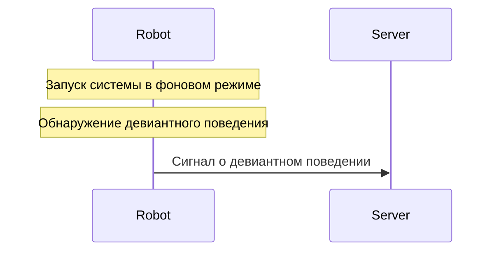

Алгоритм работы модели:

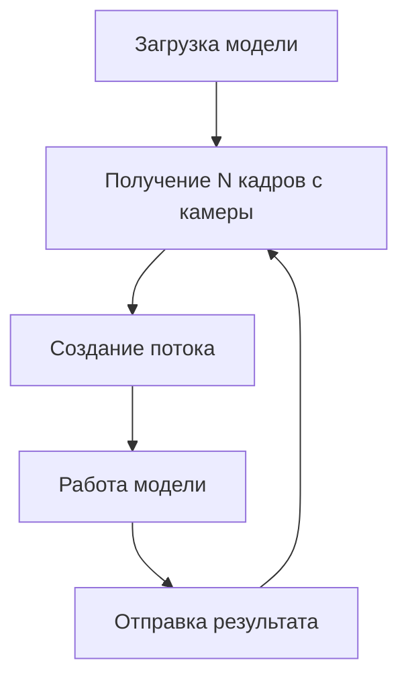

Планируется расширение функционала до:

1. Новая схема обнаружение девиантного поведения

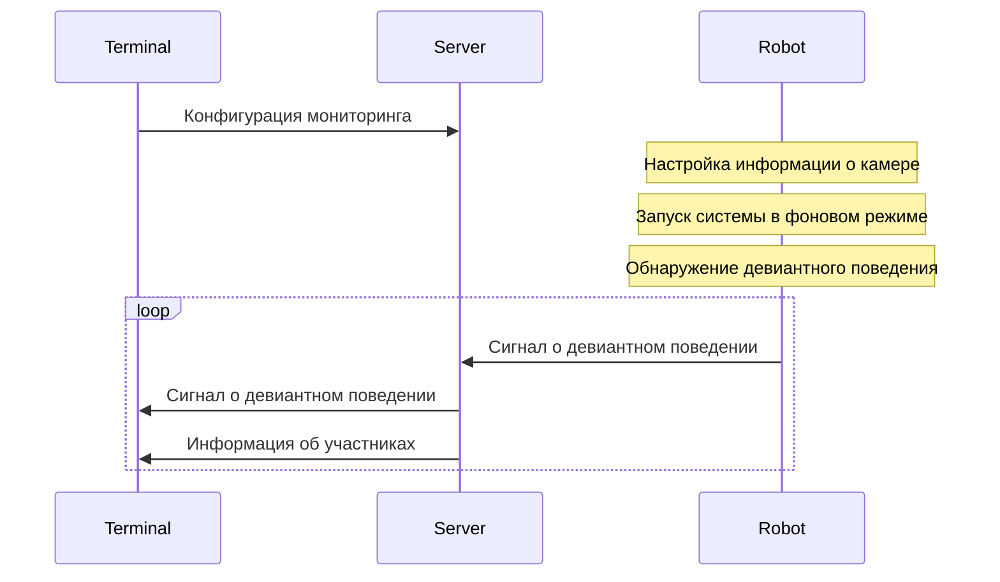

2. Обнаружение нежелательных лиц

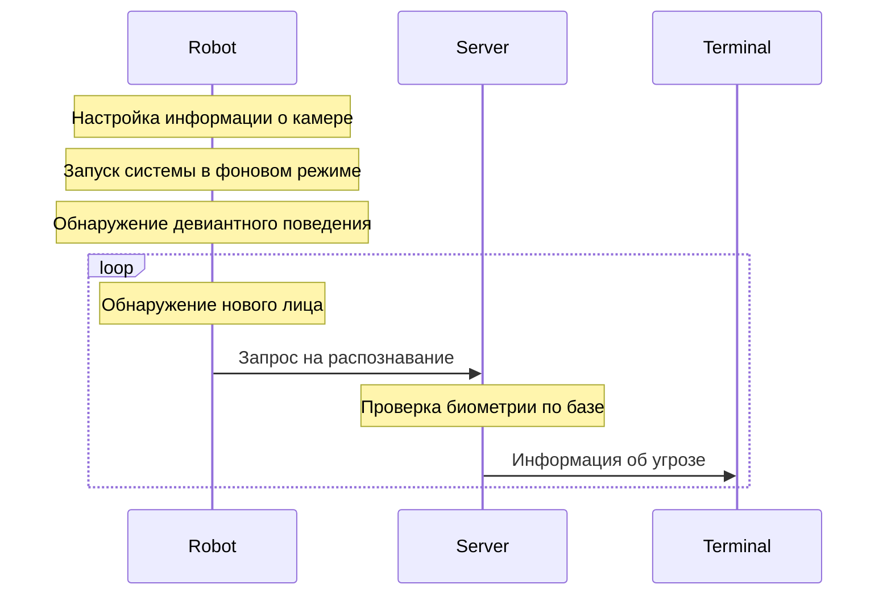

Алгоритм работы модели:

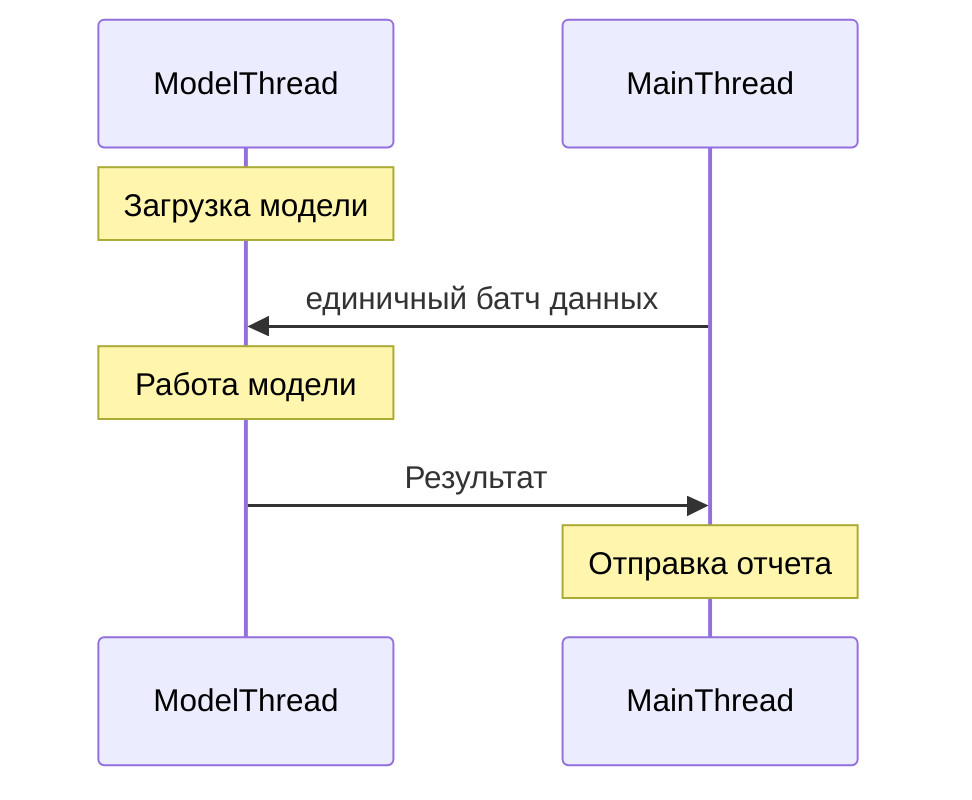

Как основная модель был
выбран [Data-efficient-video-transformer](https://github.com/NikshetSteh/Data-efficient-video-transformer)

- Модель основана на архитектуре [ViT](https://arxiv.org/abs/2010.11929), поэтому может работать с изображениями
  произвольного размера.
- Shape входного батча: `[BATCH_SIZE, FRAME_COUNT, CHANNEL, HEIGHT, WIDTH]`
- Выход модели: `[BATCH_SIZE, 1]`

Проект был разработан более 4 лет назад, так что была проведена работа над переводом его на новые версии библиотек, а
так же восстановлены веса pre-trained модели (были удалены авторам, из-за чего сейчас оригинальный пакет не работает).
Обновленная версия представлена на [GitHub](https://github.com/NikshetSteh/Data-efficient-video-transformer)

Сложность: данный "алгоритм" не имеет определенного масштабирования, то есть входные данные имеют постоянную размерность,
не меняются, а значит нельзя и оценить сложность алгоритма. 
Если все же рассматривать сложность относительное количества роботов, то она будет линейная (`O(n)`), так как обработка 
данных с каждого робота независима и соответственно выполняется за константное время[*](#Сложность-алгоритмов)

## Авторизация компонентов системы

Авторизация компонентов системы построена на основе RSA ключей
(планируется переход на более быстрые эллиптические кривые).

Первая аутентификация компонентов системы происходит на основе данных
инженера с соответствующими правами

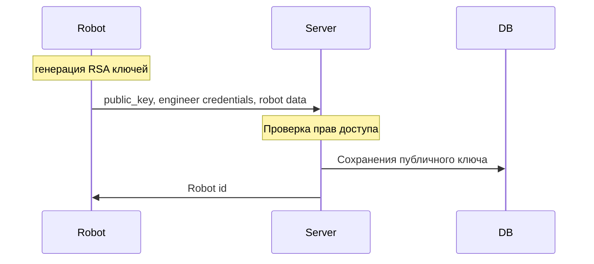

Повторная аутентификация происходит на основе RSA ключей:

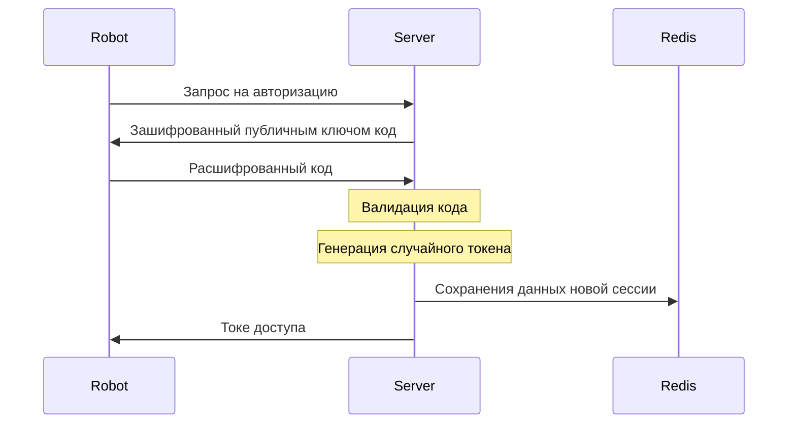

Для доступа к требующим авторизациям endpoint\`s используется схема `Bearer` (заголовок `Authorization: Bearer <token>`)

Сложность: если рассматривать алгоритм авторизации со стороны сервера и взять на входные данные запросы на авторизацию,
то тогда сложность относительно количества запросов будет линейная (`O(n)`), так как обработка каждого запроса 
происходит независимо и за константное время[*](#complexity)

# Engineer

Инженеры - пользователи системы, ответственные за её администрирование.
На данный момент их учетные записи создаются вручную через `DebugConsole` (login + password).
Авторизация инженеров так же возможна в ряде случаев через RFID карту (задаётся так же через `DebugConsole`).

Инженеры могут иметь различные независимые права доступа:

- `ROBOT_LOGIN`
- `STORE_LOGIN`
- `ROBOT_ADMIN`

# DebugConsole

Данный модуль временно заменяет админ панель.
В ней есть функционал для создания и управления пользователями, инженерами, магазинами, роботами и т. д.
Метод работы максимально прост, все действия выполняются синхронно.
Взаимодействие происходит по средствам консоли.

Структура проекта:

- `main.py` - интерфейс взаимодействия через командную строку
- `data/` - готовые тестовые наборы данный в формате json
- `auth` - вспомогательный модуль для работы с ключами
- `engineer`, `users`, ... - отдельные модули отвечают за отдельные системы

# Запуск системы

1. Запуск сервера `docker compose up -d --build`
2. Запуск `DebugConsole`:

```bash
cd DebugConsole
poetry install
poetry shell
cd src
python main.py
```

3. Создание инженера через `DebugConsole`:

```console
1. Пользователи
2. Билеты
3. Информация о городах
4. Магазины
5. Инженеры
6. Загрузка данных для тестирования
7. Магазины поездов
Введите номер режима:
> 5
1. Добавить инженера
2. Показать инженеров
3. Настройка прав
4. Удалить инженера
5. Редактировать карту доступа
> 1
Login: 
> Engineer
Password:
> EnPass
200
{
  "login": "Engineer",
  "id": "db0b3a93-a220-408e-a5b3-890a79e1a865"
}
```

4. Настройка прав инженера в `DebugConsole`:

```console
1. Пользователи
2. Билеты
3. Информация о городах
4. Магазины
5. Инженеры
6. Загрузка данных для тестирования
7. Магазины поездов
Введите номер режима:
> 5
1. Добавить инженера
2. Показать инженеров
3. Настройка прав
4. Удалить инженера
5. Редактировать карту доступа
> 3
Engineer ID: 
> db0b3a93-a220-408e-a5b3-890a79e1a865
ROBOT_LOGIN [None]:
> 1
STORE_LOGIN [None]:
> 1
ROBOT_ADMIN [None]:
> 1
200
{
  "status": "OK"
}
```

5. Авторизация компонента системы. При первом запуске потребуется ввести логин и пароль инженера:

```console
Enter engineer login: 
> Engineer
Enter engineer password: 
> EnPass
```

# Обобщение

## Используемые технологии

- Основной язык программирования - Python 3.12
- Контроль версий - [Git](https://git-scm.com/)
- Конфигурации системы - pydantic-settings
- Миграции базы данных - alembic
- Работа с базой данных - sqlalchemy
- Драйвер подключения к базе данных - asyncpg
- Построение API - fastapi + pydantic
- Работа с Redis - redis
- Интерфейс - PySide + qasync
- Бекенд для моделей - pytorch
- Распознавание лиц - insightface
- Работа с камерой и QR кодами - OpenCV
- Драйвер базы данных для alembic - psycopg2
- Асинхронное взаимодействие с низкоуровневым железом - pyserial-asyncio
- Менеджер пакетов - [poetry](https://python-poetry.org/)
- Контейнеризация и оркестрация - Docker и Docker Compose

Список всех используемых сторонних библиотек с ссылками на них:

- [PySide](https://pypi.org/project/PySide6/)
- [FastAPI](https://pypi.org/project/fastapi/)
- [bcrypt](https://pypi.org/project/bcrypt/)
- [pydantic-settings](https://pypi.org/project/pydantic-settings/)
- [fastapi-pagination](https://pypi.org/project/fastapi-pagination/)
- [insightface](https://pypi.org/project/insightface/)
- [chromadb](https://pypi.org/project/chromadb/)
- [asyncpg](https://pypi.org/project/asyncpg/)
- [asyncpg](https://pypi.org/project/asyncpg/)
- [redis](https://pypi.org/project/redis/)
- [cryptography](https://pypi.org/project/cryptography/)
- [aiohttp](https://pypi.org/project/aiohttp/)
- [alembic](https://pypi.org/project/alembic/)
- [uvicorn](https://pypi.org/project/uvicorn/)
- [psycopg2-binary](https://pypi.org/project/psycopg2-binary/)
- [isort](https://pypi.org/project/isort/)
- [qasync](https://pypi.org/project/qasync/)
- [opencv-python](https://pypi.org/project/opencv-python/)
- menovideo [оригинал](https://pypi.org/project/menovideo) и
  [исправленная нами версия](https://github.com/NikshetSteh/Data-efficient-video-transformer.git)
- [timm](https://pypi.org/project/timm/)
- [scikit-image](https://pypi.org/project/scikit-image/)
- [numpy](https://pypi.org/project/numpy/)
- [pyserial-asyncio](https://pypi.org/project/pyserial-asyncio/)
- [shiboken6](https://pypi.org/project/shiboken6/)
- [jinja2](https://pypi.org/project/jinja2/)
- [insightface](https://pypi.org/project/insightface/)
- [chromadb](https://pypi.org/project/chromadb/)
- [requests](https://pypi.org/project/requests/)

### Нейронные сети

#### [InsightFace](https://github.com/deepinsight/insightface)

На вход модели поступает изображение произвольного размера, далее
во внутреннем алгоритме оно приводится к размеру `640*640*3`.
На выходе модели есть несколько параметров, включающих BBOXs для каждого
обнаруженного лица, а так же эмбеддинги (размерность `512`) для них.

# Исходный код

Весь код, модели, схемы и исходники самой этой технической документации
(в формате markdown и схемы в формате mermaid)
представлены на [github](https://github.com/NikshetSteh/TransportationEngineers/)  
https://github.com/NikshetSteh/TransportationEngineers/

# Ремарки 
## Сложность алгоритмов
*оценивать сложность данных алгоритмов не совсем корректно, так как оценка сложность в большой степени относятся к 
алгоритма обработки данных не постоянной размерности, а в данном случае речь идет об системах взаимодействия (API)