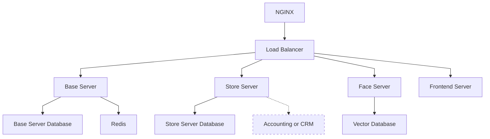
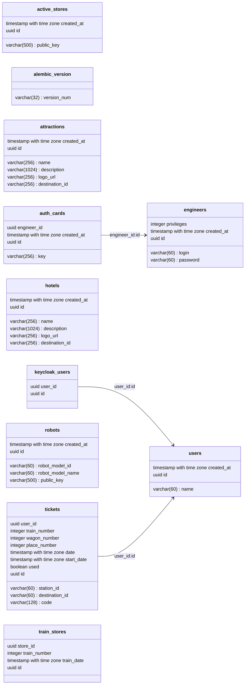
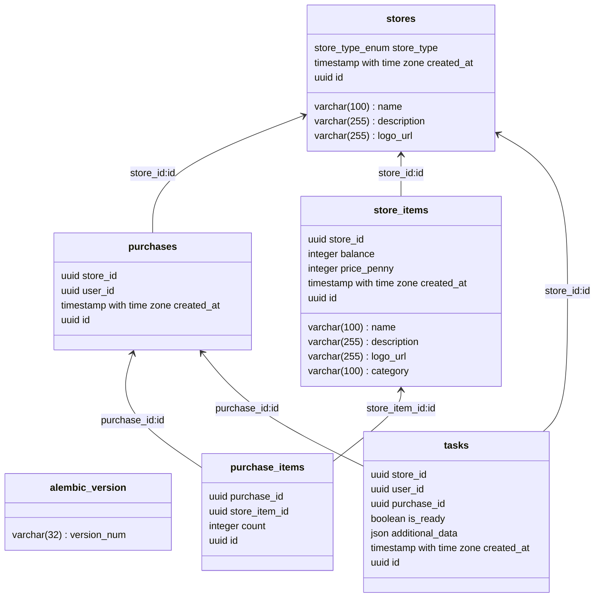

# Архитектура сервера



Главной технической частью проекта является сервер.
Он состоит из нескольких модулей которые представлены в диаграмме выше.

## Высокоуровневая архитектура

Backend состоит из 4 основных модулей:

- Основной сервис
- Сервис магазинов
- Сервис биометрии
- Frontend
  Так же есть несколько дополнительных модулей:
- DebugConsole (для отладки, временно заменяет админ панель)
- DebugData (набор тестовых данных)

Входным шлюзом служит Nginx и его встроенный балансировщик нагрузок.

Каждому модулю так же соответствует база данных (за исключением frontend).

## Запуск сервера

Сервер запускается посредством Docker Compose. В корне проекта находится файл конфигурации `compose.yml`.

```bash
docker-compose up -d --build
```

## Nginx

Конфигурации nginx находятся в корне проекта (файл `nginx.conf`).
Она автоматически монтируется в образ Docker.

Монтируются следующие пути:

- `/static` - статический контент
- `/keycloak` - доступ к keycloak
- `/base_api` - основной сервис
- `/store_api` - сервис магазинов

# Общее описание модулей

Все модули имеют определенный шаблон:

```
/module_name
├── app
├──── main.py
├──── config.py
├── pyproject.toml
├── poetry.toml
└── Dockerfile
```

- `app` (или `src`) - содержит исходный код модуля
- `pyproject.toml` - Зависимости
- `poetry.toml` - конфигурация poetry
- `Dockerfile` - конфигурация docker (при необходимости)
- `config.py` - конфигурация приложение (
  используется [pydantic-settings](https://pydantic-docs.helpmanual.io/usage/settings/))

Все модули (работающие на python) используют [poetry](https://python-poetry.org) для управления зависимостями.

Стандартная конфигурация poetry (`poetry.toml`)

```toml
[virtualenvs]
in-project = true # Создавать виртуальное окружение внутри проекта
```

## Серверные модули

- Основной фреймворк - [FastAPI](https://fastapi.tiangolo.com)
- Реляциональная база данных - [Postgres](https://www.postgresql.org/)
- Кэш - [Redis](https://redis.io/)
- Векторная база данных - [ChromaDB](https://github.com/duckdblabs/chroma)
- Миграция базы данных - [alembic](https://alembic.sqlalchemy.org/en/latest/)

Базовая структура:

```
app
├── alembic
├── models
├── some_submodule
├──── schemes
├──── router
├──── service
├──── depencies
├── main.py
├── alembic.ini
├── depencies
└── schemes
```

- `main.py` содержит root router. Все другие модули подключаются к нему из `some_submodule/router.py`.
- `service.py` содержит бизнес логику.
- `router` роутеры отдельных submodules.
- `depencies`, `schenes`, `exceptions`, ... - зависимости, схемы, исключения... Могу быть глобальные и привязанные к
  отельным
  submodules
- `alembic.ini` - конфигурация alembic
- `models` - модели базы данных
- `alembic` - система миграции баз данных. Стандартный `env.py` был переписан

# Base Server

Основной сервер. Отвечает почти за все взаимодействие с роботом, на время тестов эмулирует логику основного сервера ЖД
компании

## Submodules

- `admin` - отвечает за отладку, заменяет основной сервис ЖД компании. Отвечает за создание билетов, регистрацию
  инженеров
  и так далее. Исключительно на время разработки, использование на проде не предусмотренно
- `auth` - отвечает за авторизацию. Предоставляет Dependencies для авторизации пользователя
- `robot` - отвечает за работу с роботом. Реализует такие функции как проверка билетов, авторизация пользователей и т.
  д.
- `users` - отвечает за работу с пользователями. В основном предоставление информации для робота
- `face_api` - внешняя зависимость сервиса биометрии
- `store_api` - внешняя зависимость сервиса магазинов
- `redis_async` - небольшая обертка для работы с redis через асинхронный контекстный менеджер

## База данных



# Store Server

Отвечает за работу магазинов

## Submodules

- `admin` - отвечает за отладку, заменяет основной сервис ЖД компании. Отвечает за создание билетов, регистрацию
  инженеров
  и так далее. Исключительно на время разработки, использование на проде не предусмотренно
- `redis_async` - небольшая обертка для работы с redis через асинхронный контекстный менеджер
- `robot` - взаимодействие с роботом
- `store` - взаимодействие с магазинами

## База данных



## Endpoints

### 1. Store Management

#### Create Store

**Endpoint:** `POST /admin/store`

**Description:** Creates a new store.

**Request Body:**

```json
{
  "name": "string",
  "description": "string",
  "logo_url": "string",
  "store_type": "SHOP | RESTAURANT"
}
```

**Response:**

```json
{
  "id": "string",
  "name": "string",
  "description": "string",
  "logo_url": "string",
  "store_type": "SHOP | RESTAURANT"
}
```

**Errors:**

- `422 Validation Error`

#### Get Stores

**Endpoint:** `GET /admin/stores`

**Description:** Retrieves a list of stores.

**Query Parameters:**

- `page` (integer, default: 1) - Page number
- `size` (integer, default: 50, max: 100) - Number of results per page

**Response:**

```json
{
  "items": [
    {
      "id": "string",
      "name": "string",
      "description": "string",
      "logo_url": "string",
      "store_type": "SHOP | RESTAURANT"
    }
  ],
  "total": 100,
  "page": 1,
  "size": 50
}
```

**Errors:**

- `422 Validation Error`

#### Get Store

**Endpoint:** `GET /admin/store/{store_id}`

**Description:** Retrieves details of a specific store.

**Path Parameters:**

- `store_id` (string) - Unique identifier of the store

**Response:**

```json
{
  "id": "string",
  "name": "string",
  "description": "string",
  "logo_url": "string",
  "store_type": "SHOP | RESTAURANT"
}
```

**Errors:**

- `422 Validation Error`

#### Delete Store

**Endpoint:** `DELETE /admin/store/{store_id}`

**Description:** Deletes a store.

**Path Parameters:**

- `store_id` (string) - Unique identifier of the store

**Response:**

```json
{
  "status": "OK"
}
```

**Errors:**

- `422 Validation Error`

### 2. Store Items Management

#### Get Items

**Endpoint:** `GET /store/items`

**Description:** Retrieves a list of store items.

**Query Parameters:**

- `page` (integer, default: 1) - Page number
- `size` (integer, default: 50, max: 100) - Number of results per page

**Response:**

```json
{
  "items": [
    {
      "id": "string",
      "name": "string",
      "description": "string",
      "price_penny": 1000
    }
  ],
  "total": 100,
  "page": 1,
  "size": 50
}
```

**Errors:**

- `422 Validation Error`

#### Get Item

**Endpoint:** `GET /store/item/{item_id}`

**Description:** Retrieves details of a specific item.

**Path Parameters:**

- `item_id` (string) - Unique identifier of the item

**Response:**

```json
{
  "id": "string",
  "name": "string",
  "description": "string",
  "price_penny": 1000
}
```

**Errors:**

- `422 Validation Error`

#### Add Item

**Endpoint:** `POST /store/item`

**Description:** Adds a new item to the store.

**Request Body:**

```json
{
  "name": "string",
  "description": "string",
  "price_penny": 1000
}
```

**Response:**

```json
{
  "id": "string",
  "name": "string",
  "description": "string",
  "price_penny": 1000
}
```

**Errors:**

- `422 Validation Error`

### Update Item

**Endpoint:** `PUT /store/item`

**Description:** Updates an existing item.

**Request Body:**

```json
{
  "id": "string",
  "name": "string",
  "description": "string",
  "price_penny": 1000
}
```

**Response:**

```json
{
  "id": "string",
  "name": "string",
  "description": "string",
  "price_penny": 1000
}
```

**Errors:**

- `422 Validation Error`

#### Remove Item

**Endpoint:** `DELETE /store/item/{item_id}`

**Description:** Removes an item from the store.

**Path Parameters:**

- `item_id` (string) - Unique identifier of the item

**Response:**

```json
{
  "status": "OK"
}
```

**Errors:**

- `422 Validation Error`

### 3. Purchase Management

#### Make Purchase

**Endpoint:** `POST /store/purchase`

**Description:** Creates a new purchase.

**Request Body:**

```json
{
  "user_id": "string",
  "items": [
    {
      "item_id": "string",
      "count": 1
    }
  ],
  "is_default_ready": true
}
```

**Response:**

```json
{
  "id": "string",
  "store_id": "string",
  "user_id": "string",
  "items": [
    {
      "item_id": "string",
      "count": 1
    }
  ],
  "date": "2024-01-01T12:00:00Z"
}
```

**Errors:**

- `422 Validation Error`
