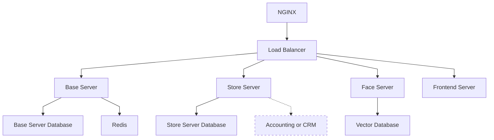

# Архитектура сервера



Главной технической частью проекта является сервер.
Он состоит из нескольких модулей которые представлены в диаграмме выше.

## Высокоуровневая архитектура

Backend состоит из 4 основных модулей:

- Основной сервис
- Сервис магазинов
- Сервис биометрии
- Frontend
  Так же есть несколько дополнительных модулей:
- DebugConsole (для отладки, временно заменяет админ панель)
- DebugData (набор тестовых данных)

Входным шлюзом служит Nginx и его встроенный балансировщик нагрузок.

Каждому модулю так же соответствует база данных (за исключением frontend).

## Запуск сервера

Сервер запускается по средствам Docker Compose. В корне проекта находится файл конфигурации `compose.yml`.

```bash
docker-compose up -d --build
```

## Nginx

Конфигурации nginx находятся в корне проекта (файл `nginx.conf`).
Она автоматически монтируется в образ Docker.

Монтируются следующие пути:

- `/static` - статический контент
- `/keycloak` - доступ к keycloak
- `/base_api` - основной сервис
- `/store_api` - сервис магазинов

# Общее описание модулей

Все модули имеют определенный шаблон:

```
/module_name
├── app
├──── main.py
├──── config.py
├── pyproject.toml
├── poetry.toml
└── Dockerfile
```

- `app` (или `src`) - содержит исходный код модуля
- `pyproject.toml` - Зависимости
- `poetry.toml` - конфигурация poetry
- `Dockerfile` - конфигурация docker (при необходимости)
- `config.py` - конфигурация приложение (
  используется [pydantic-settings](https://pydantic-docs.helpmanual.io/usage/settings/))

Все модули (работающие на python) используют [poetry](https://python-poetry.org) для управления зависимостями.

Стандартная конфигурация poetry (`poetry.toml`)

```toml
[virtualenvs]
in-project = true # Создавать виртуальное окружение внутри проекта
```

## Серверные модули

- Основной фреймворк - [FastAPI](https://fastapi.tiangolo.com)
- Реляциональная база данных - [Postgres](https://www.postgresql.org/)
- Кэш - [Redis](https://redis.io/)
- Векторная база данных - [ChromaDB](https://github.com/duckdblabs/chroma)
- Миграция базы данных - [alembic](https://alembic.sqlalchemy.org/en/latest/)

Базовая структура:

```
app
├── alembic
├── models
├── some_submodule
├──── schemes
├──── router
├──── service
├──── depencies
├── main.py
├── alembic.ini
├── depencies
└── schemes
```

- `main.py` содержит root router. Все другие модули подключаются к нему из `some_submodule/router.py`.
- `service.py` содержит бизнес логику.
- `router` роутеры отдельных submodules.
- `depencies`, `schenes`, `exceptions`, ... - зависимости, схемы, исключения... Могу быть глобальные и привязанные к
  отельным
  submodules
- `alembic.ini` - конфигурация alembic
- `models` - модели базы данных
- `alembic` - система миграции баз данных. Стандартный `env.py` был переписан

# Base Server

Основной сервер. Отвечает почти за все взаимодействие с роботом, на время тестов эмулирует логику основного сервера ЖД
компании

## Submodules
- `admin` - отвечает за отладку, заменяет основной сервис ЖД компании. Отвечает за создание билетов, регистрацию инженеров
  и так далее. Исключительно на время разработки, использование на проде не предусмотренно
- `auth` - отвечает за авторизацию. Предоставляет Dependencies для авторизации пользователя
- `robot` - отвечает за работу с роботом. Реализует такие функции как проверка билетов, авторизация пользователей и т. д.
- `users` - отвечает за работу с пользователями. В основном предоставление информации для робота 
- `face_api` - внешняя зависимость сервиса биометрии
- `store_api` - внешняя зависимость сервиса магазинов
- `redis_async` - небольшая обертка для работы с redis через асинхронный контекстный менеджер 

## OpenAPI specification
<В РАЗРАБОТКЕ>

