# Техническая часть

## Архитектура

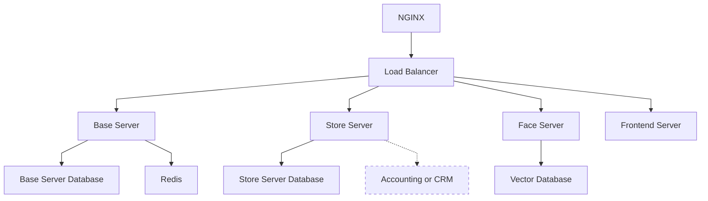

Система представляет из себя модульную конструкцию базирующуюся на
нескольких сервисах:

- Base Server. 
  Совмещает в себе эмуляцию сервисов самой ЖД компании,
  а также взаимодействие с аппаратными комплексом
- Store Server.
  Предоставляет API для работы различных магазинов и
  ресторанов интегрированных в систему
- Face Server.
  Отвечает за работу с биометрией
- Frontend Server.
  Предоставляет сайт для взаимодействия с
  пользователями

Планируется добавление систем сбора данных о состоянии системы и логов

### Базы данных

Для основных задач была выбрана СУБД PostgresSQL, для хранения биометрии ChromaDB и для
хранения сессий Redis

#### ChromaDB

Одна коллекция, один тип записей в формате: вектор + метаданные (user_id)

#### Redis

Две коллекции:

- Сессии в формате: session_token: user_id, session_id
- Запросы на авторизацию: user_id: request_id

#### Базовый сервер

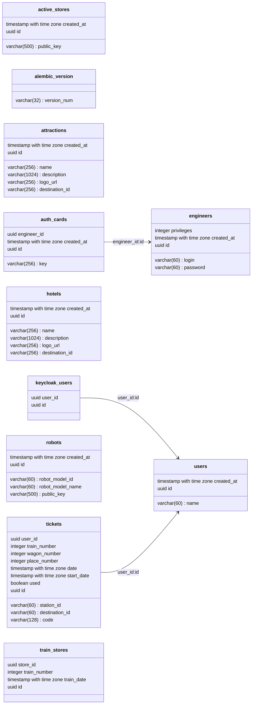

#### Сервис магазинов

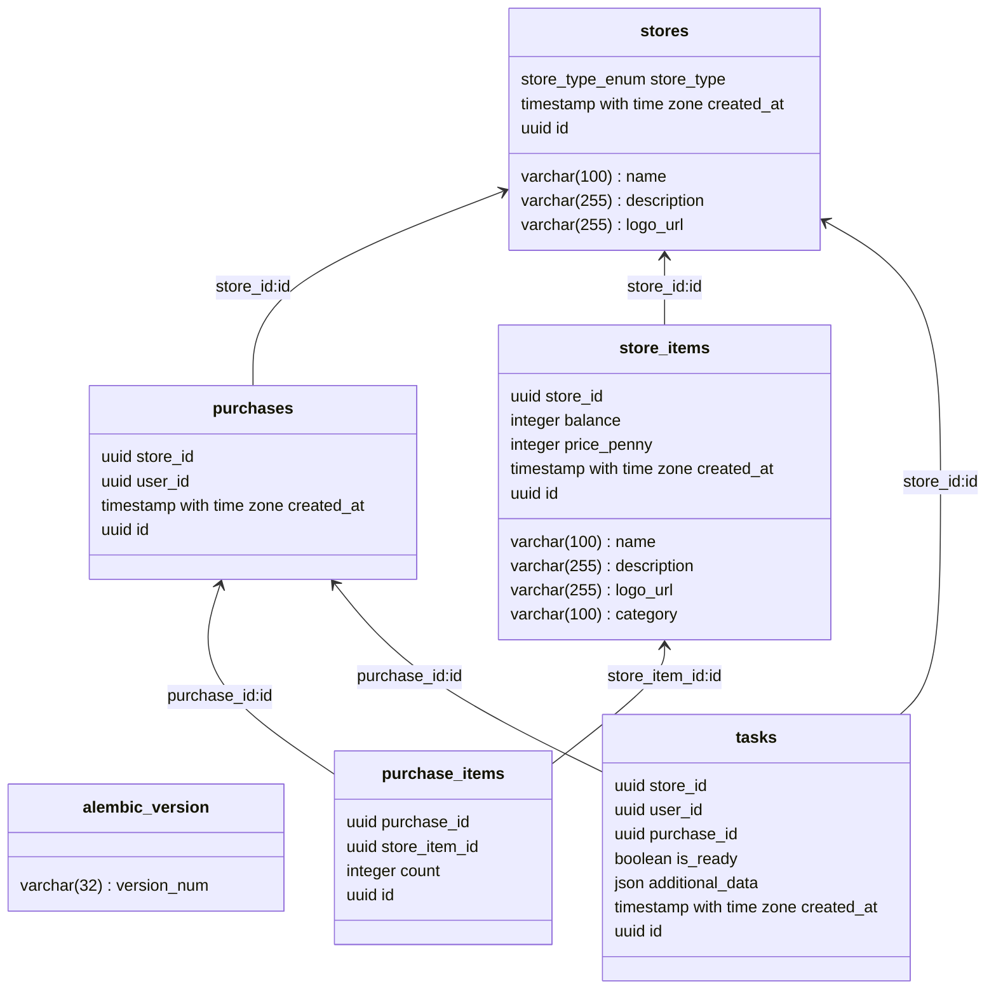

### Компонент системы

При разработке базы для всех компонентов системы был использован асинхронный-функциональный подход.
Графическим фреймворком послужил `PySide`. Так как PySide построен на основе синхронной архитектуры,
для асинхронной обработки использовались дополнительные пакеты, такие как `qasync`, а так же
встраивание кастомного event-loop в основную логику приложения:

```python
from PySide6.QtWidgets import QApplication
from qasync import QEventLoop
import sys
import asyncio


async def main(app_loop):
    while True:
        pass


# Запуск PySide приложение параллельно с асинхронным кастомным event-loop
application = QApplication(sys.argv)
loop = QEventLoop(application)
asyncio.set_event_loop(loop)
loop.run_until_complete(main(loop))
```

### Особенности системы

Система не обладает какими-то особыми алгоритмами и структурами данных,
в основном только массивы и словари.
Временная сложность у всех endpoints можно считать константой или линейной
от количества пользователей в системе.

## Алгоритмы

### Авторизация и Аутентификация компонентов системы

Первая аутентификация компонентов системы происходит на основе данных
инженера с соответствующими правами

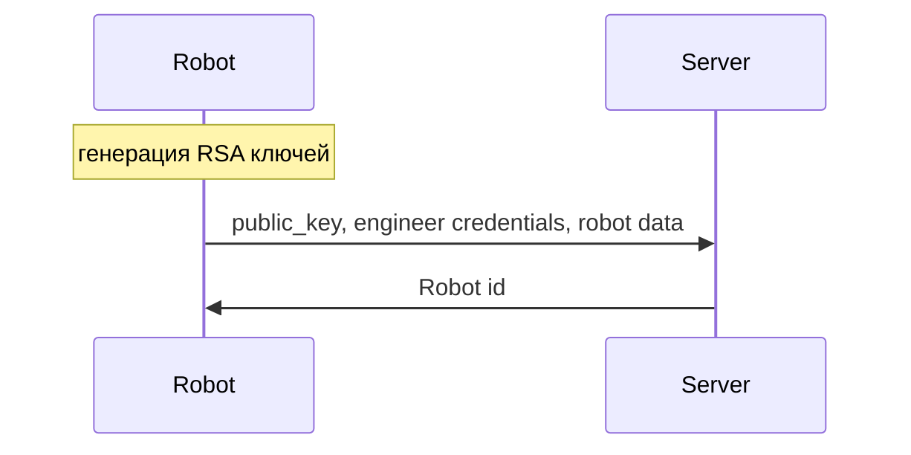

Повторная аутентификация происходит на основе RSA ключей:

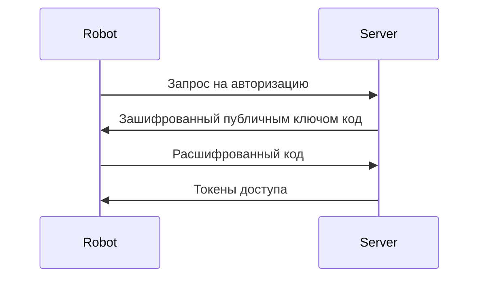

Для авторизации соответственно используются токены доступа полученные при аунтентификации
через заголовок `Authorization: Bearer <token>`

### Рекомендательный алгоритм

Для систем рекомендации временно используется упрощенный алгоритм. В момента запроса
формируется несколько списков популярных товаров:

- Личные предпочтения пользователя
- Товары популярные в магазине

А так же список последних покупок товаров. На их основе определяется рекомендованный список
товаров

### Проверка доступа к админ-панели робота

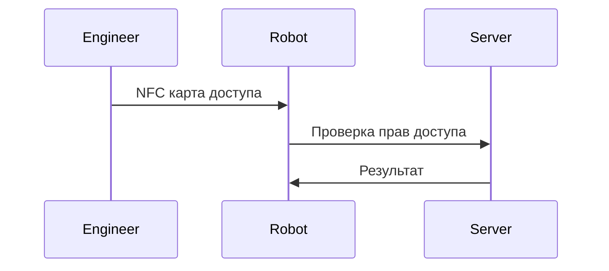

### Система интеллектуального видеонаблюдения

На текущий момент алгоритм выглядит следующим образом:

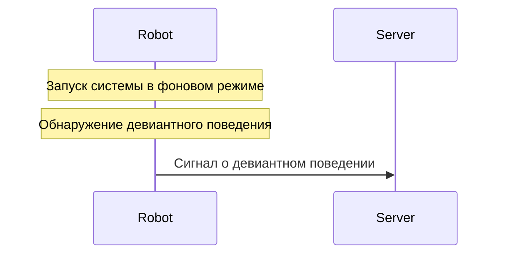

Алгоритм работы модели:
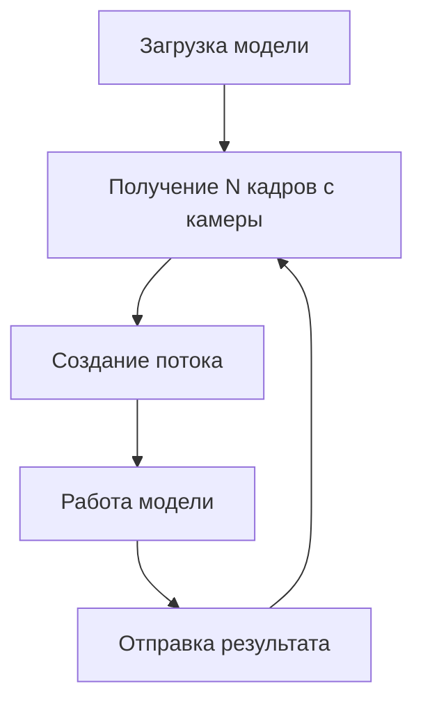

Планируется расширение функционала до:

1. Обнаружение девиантного поведения

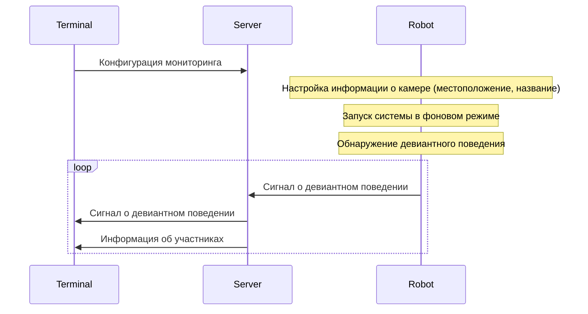

2. Обнаружение нежелательных лиц

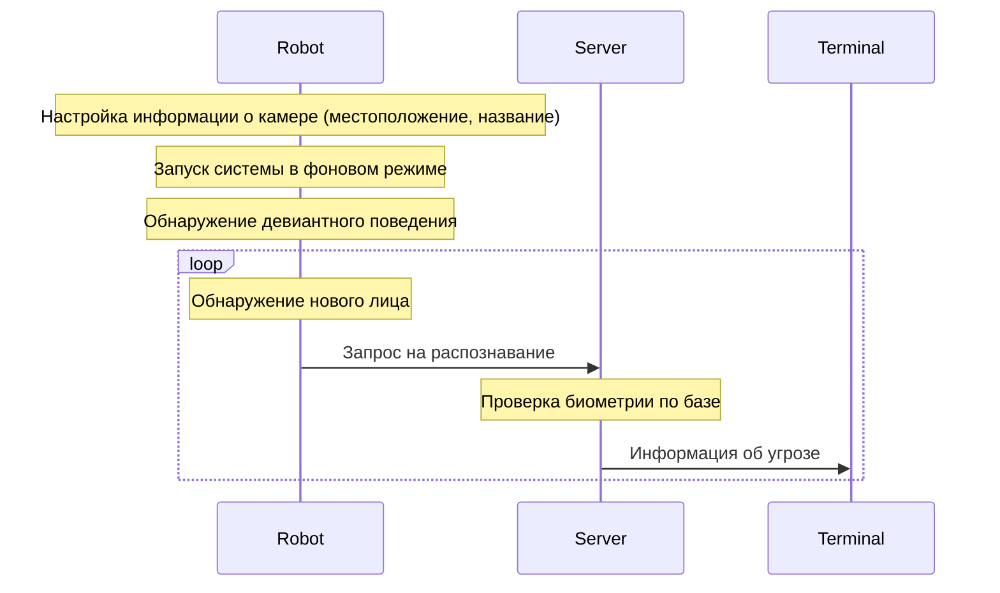

Алгоритм работы модели:
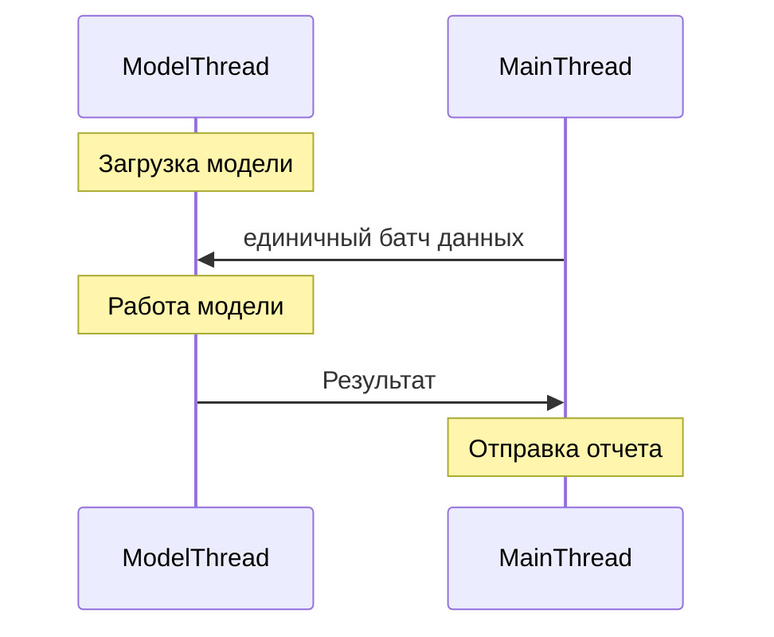

### Проверка билетов

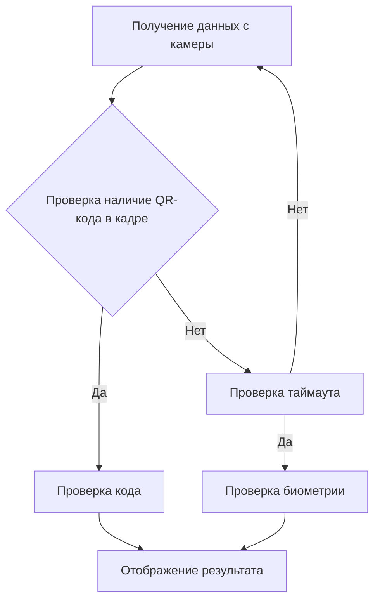

### Отладка 
Для отладки системы был создан отдельный модуль DebugConsole, который 
заменял админ панель и реальную интеграцию с системами ЖД

## Используемые технологии

- Основной язык программирования - Python 3.12
- Контроль версий - [Git](https://git-scm.com/)
- Конфигурации системы - pydantic-settings
- Миграции базы данных - alembic
- Работа с базой данных - sqlalchemy
- Драйвер подключения к базе данных - asyncpg
- Построение API - fastapi + pydantic
- Работа с Redis - redis
- Интерфейс - PySide + qasync
- Бекенд для моделей - pytorch
- Распознавание лиц - insightface
- Работа с камерой и QR кодами - OpenCV
- Драйвер базы данных для alembic - psycopg2  
- Асинхронное взаимодействие с низкоуровневым железом - pyserial-asyncio
- Менеджер пакетов - [poetry](https://python-poetry.org/)
- Контейнеризация и оркестрация - Docker и Docker Compose

Список всех используемых сторонних библиотек с ссылками на них:
- [PySide](https://pypi.org/project/PySide6/)
- [FastAPI](https://pypi.org/project/fastapi/)
- [bcrypt](https://pypi.org/project/bcrypt/)
- [pydantic-settings](https://pypi.org/project/pydantic-settings/)
- [fastapi-pagination](https://pypi.org/project/fastapi-pagination/)
- [insightface](https://pypi.org/project/insightface/)
- [chromadb](https://pypi.org/project/chromadb/)
- [asyncpg](https://pypi.org/project/asyncpg/)
- [asyncpg](https://pypi.org/project/asyncpg/)
- [redis](https://pypi.org/project/redis/)
- [cryptography](https://pypi.org/project/cryptography/)
- [aiohttp](https://pypi.org/project/aiohttp/)
- [alembic](https://pypi.org/project/alembic/)
- [uvicorn](https://pypi.org/project/uvicorn/)
- [psycopg2-binary](https://pypi.org/project/psycopg2-binary/)
- [isort](https://pypi.org/project/isort/)
- [qasync](https://pypi.org/project/qasync/)
- [opencv-python](https://pypi.org/project/opencv-python/)
- menovideo [оригинал](https://pypi.org/project/menovideo) и 
[исправленная нами версия](https://github.com/NikshetSteh/Data-efficient-video-transformer.git)
- [timm](https://pypi.org/project/timm/)
- [scikit-image](https://pypi.org/project/scikit-image/)
- [numpy](https://pypi.org/project/numpy/)
- [pyserial-asyncio](https://pypi.org/project/pyserial-asyncio/)
- [shiboken6](https://pypi.org/project/shiboken6/)
- [jinja2](https://pypi.org/project/jinja2/)
- [insightface](https://pypi.org/project/insightface/)
- [chromadb](https://pypi.org/project/chromadb/)
- [requests](https://pypi.org/project/requests/)


### Нейронные сети
#### [Data-efficient-video-transformer](https://github.com/NikshetSteh/Data-efficient-video-transformer)
Модель основана на архитектуре [ViT](https://arxiv.org/abs/2010.11929)
поэтому может работать с изображениями произвольного размера.
Shape входного батча: `[BATCH_SIZE, FRAME_COUNT, CHANNEL, HEIGHT, WIDTH]`
Выход модели: `[BATCH_SIZE, 1]`


#### [InsightFace](https://github.com/deepinsight/insightface)
На вход модели поступает изображение произвольного размера, далее 
во внутреннем алгоритме оно приводится к размеру `640*640*3`.
На выходе модели есть несколько параметров, включающих BBOXs для каждого
обнаруженного лица, а так же эмбеддинги (размерность `512`) для них.


## Исходный код
Весь код, модели, схемы и исходники самой этой технической документации
(в формате markdown и схемы в формате mermaid)
представлены на [github](https://github.com/NikshetSteh/TransportationEngineers/)  
https://github.com/NikshetSteh/TransportationEngineers/